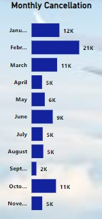

# 2015-FLIGHT-DELAY-AND-CANCELLATION-IN-US

## INTRODUCTION
Flight cancellation occurs when the airline does not operate the flight that it was supposed to operate. This can occur for certain inevitable reasons. In 2015, a total of 5,000,000+ flights were recorded by the U.S. DOT Air Travel Consumer Report.

## AIM OF ANALYSIS
The analysis is aimed at checking
•	The number of flights cancelled
•	Rate of cancellation
•	Reason for cancellation
•	Percentage of cancellation

## SKILLS DEMONSTRATED
Some of the skills demonstrated are
1.	Column expansion
2.	Merge queries
3.	Sort and filter.
4.	Remove column
5.	Duplicated columns
6.	Split column
7.	Replace values
8.	Conditional column

## DATA TRANSFORMATION
The data set was loaded into Power Query for transformation. The data set contains four tables, which are airlines. Airport, cancellation codes, and flight the airline, airport, and cancellation codes were merged together into a table using their primary keys. This new merged column was then cleaned and transformed before loading into Power BI for visualization.

## DATA SOURCING
The data set was gotten from Kaggle.com.

## ANALYSIS AND VISUALIZATION
The analysis was done with Power BI Desktop. After visualization, the total number of cancelled flights in 2015 was 90k. The total number of airlines operating was 14. The total flights for the year are 5.82 million.

**Total cancelled flights per month**

This chart shows the number of flights that were cancelled in the month. The most flights, around 21k, were cancelled in February, while the least flights were cancelled in September, which were around 2k. No flight was cancelled in December.

**Cancellation by airline**

This shows the number of flights cancelled by each airline in 2015. Southwest Airlines cancelled over 15k flights, which is the most, while Hawaii Airlines cancelled less than 1k flights, which is the least.

**Cancellation Reason**

This shows the percentage of cancellations. This pie chart displays that the main reason for cancellation of a flight is weather, which carries the highest percentage of cancellation reasons, followed by airline or carrier, then National Air System. The percentage of security is very low because it is hardly a reason for cancellation.

**Cancellation by Airport (Top 10)**

This shows the top 10 airports with the highest number of cancellations. Chicago International Airport cancelled the most flights, which is over 8K flights.

**Cancellation per day**

This shows the number of flights cancelled each day of the week. Overall, most flights were cancelled on Sunday.

**% of cancelled flight**

This shows the percentage of the flight that was cancelled. The percent of flights cancelled is 1.54 of the total.

## CONCLUSION AND RECOMMENDATION.
Though the percentage of cancelled flights is small, it is essential that the airline companies find a way to avoid flight cancellation and delay, as this can be disappointing and affect a lot of planned activities and events, which can in turn cause some individuals, companies, firms, or organizations a fortune that may be hard to bounce back from. My recommendations would be that:
1.	The section in charge of flight booking should ensure that all measures have been put in place before allowing the booking of flights.
2.	Airlines and airports should work closely with weather forecasters to receive weather condition reports and information on time, as this is the main reason for cancellation, so that delays or cancellations are communicated on time.
3.	Airlines and airports should target periods with increased flight booking and ensure that necessary measures are put in place so as to avoid unnecessary delays and cancellations that could have been avoided.
4.	Airlines and airports should request a prompt report from the national air system so as to get information about air navigation, landing areas, and other essential information relating to flights.

## DASHBOARD

You can interract with the dashboardby by clicking  [here](https://app.powerbi.com/view?r=eyJrIjoiNWIwNzhhNTQtNWZiNi00MjU0LTkxOWQtYWY4YmZmNzAwOGMyIiwidCI6ImRmODY3OWNkLWE4MGUtNDVkOC05OWFjLWM4M2VkN2ZmOTVhMCJ9&embedImagePlaceholder=true)

